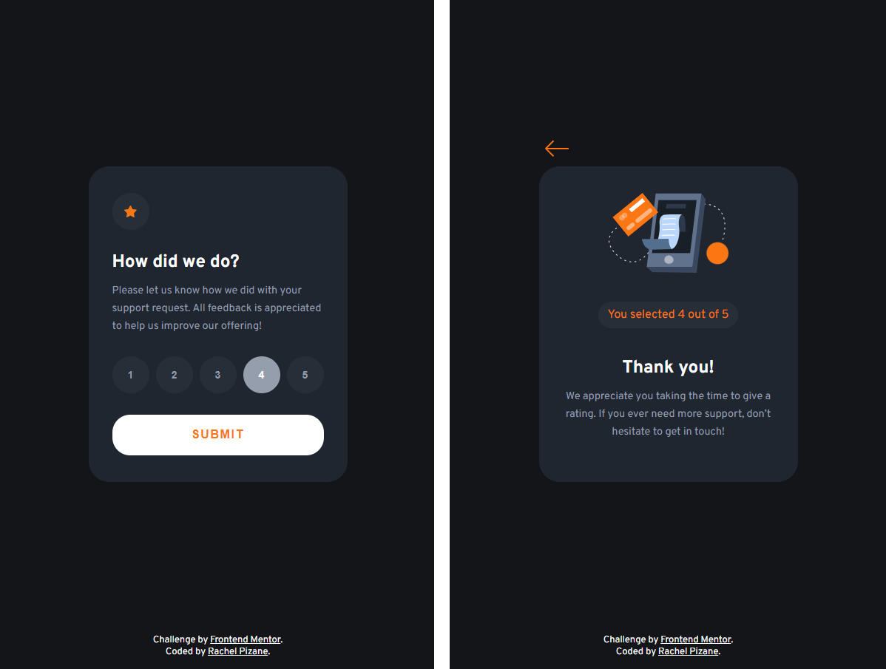
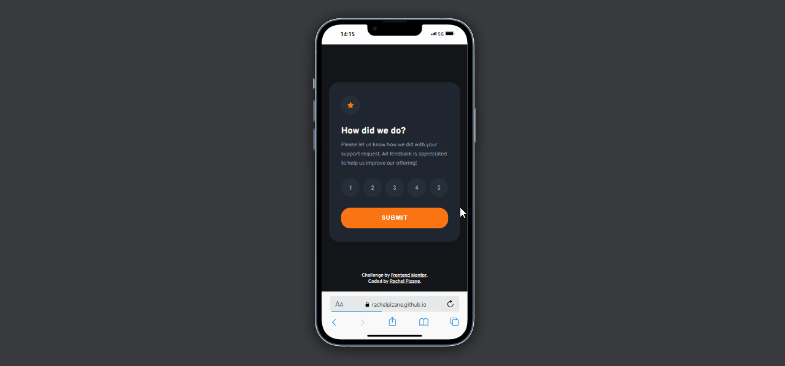

# Interactive rating component solution | Frontend Mentor

## 1. Introduction 📝

This is a solution to the [Interactive rating component challenge on Frontend Mentor](https://www.frontendmentor.io/challenges/interactive-rating-component-koxpeBUmI).
 

## 2. Project status  🕜

 Completed!

## 3. Overview 🌎

### 3.1. Screenshot

 

### 3.2 Links

- Live Site URL: [GitHub Page - Interactive rating component](https://rachelpizane.github.io/FM06-interactive-rating-component/)

## 4. My process 🗺️

### 4.1. Built with

- HTML5; 
- CSS3;
- Grid;
- Flexbox;
- Javascript
 

### 4.2. What I learned

By completing this project with HTML, CSS, and Javascript, I significantly improved my Javascript skills, particularly in functions, conditionals, and DOM manipulation. 

In addition to the requested features, I implemented a button that allows users to return to the homepage, resetting any previously submitted evaluation. 

Furthermore, I added a condition that displays an alert if the user tries to click "Submit" without selecting an evaluation, informing them of the need to choose one before submitting.
 
